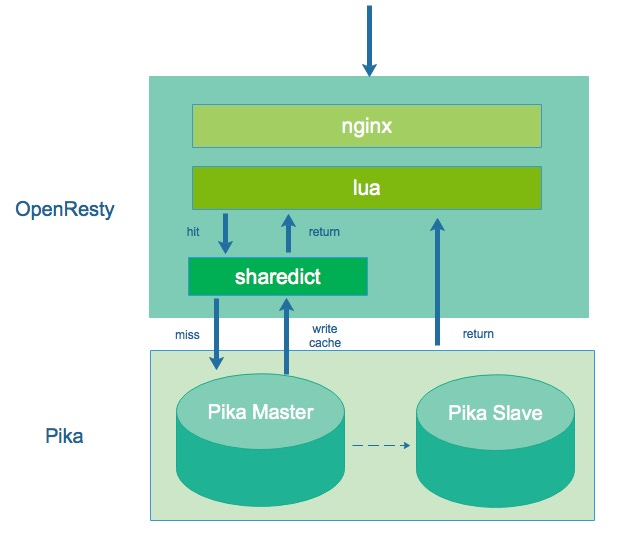
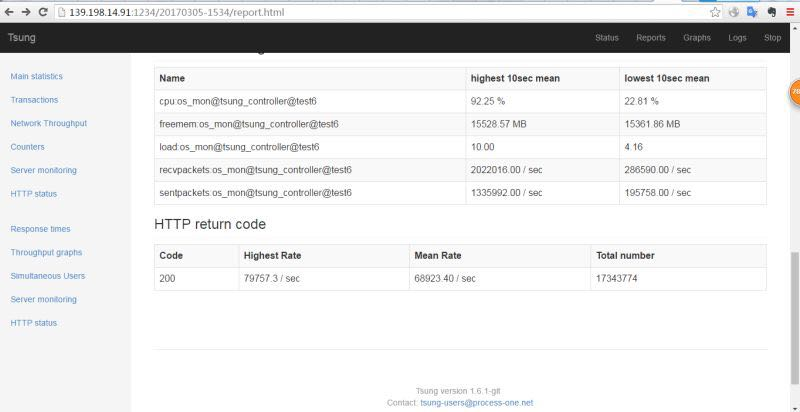

# demo_lua

本项目利用 OpenResty 和 Pika, 尝试解决 [PCC 挑战赛](https://github.com/archnotes/PCC)中提出的问题:

>实现类似 facebook 中的 like 功能，需要：

>* 可以对一个对象（一条feed、文章、或者url）进行 like 操作，禁止 like 两次，第二次 like 返回错误码
>* 有 isLike 接口，返回参数指定的对象有没有被当前用户 like 过
>* 需要看到一个对象的 like 计数
>* 可以看到一个对象的 like 用户列表（类似 QQ 空间）；
>* 上述列表加分项：Like优先显示我的好友列表(social list)。
>* 数据量：每天新增的 like 对象数为 1 千万，每秒 like 计数器查询量为 30 万次 / 秒。

我采用的是 [OpenResty](http://openresty.org/en/) + [Pika](https://github.com/Qihoo360/pika) 的架构，OpenResty 能支持高并发的请求处理，使用Lua脚本完成业务逻辑处理，利用OpenResty的 [ngx shared dict cache](https://moonbingbing.gitbooks.io/openresty-best-practices/content/ngx_lua/cache.html) 完成数据的缓存。存储层使用Pika，利用有序集合、hash等数据结构存储用户数据。



在做技术选型时，我主要从这几方面考虑：

1. 支持高并发。该场景的用户数量级为 1 千万，单机并发连接数较高。因此，选择的开发语言需要支持高并发特性，最好还是异步非阻塞的IO模型，才能达到比较高的性能。可选的开发语言有Golang\Nodejs\OpenResty\Erlang等。我选择了自己比较熟悉的OpenResty。
2. 缓存设计。为了达到 30 万的qps,缓存的设计必不可少，一方面可以提升读写性能，另一方面可以降低后端存储的压力。比较流行的做法是使用Redis作为缓存层。OpenResty的sharedict是Nginx worker进程间的内存缓存。与Redis不同的是,访问sharedict时 OpenResty 不需要发起网络请求，减少了网络开销。在简单的kv缓存上，性能要高于Redis。 因此，我直接利用OpenResty的shared dict cache完成缓存设计。
3. 后端存储。数据量比较大，比赛方提供的数据量在数百GB级别。如果Redis作为DB，可以达到较高性能，但是存储的数据量受限于服务器内存大小（小于16G)，无法满足需求。关系型数据库可以存储该数量级的数据，是比较成熟的存储方案。可以选择MySQL、PostgreSQL做为存储，在实现list操作时需要做大表的联表查询。最近了解到Pika这个开源的存储系统，底层使用RocksDB作为存储引擎，不但支持TB级别的数据存储，而且还具备较高的性能（看了一下GitHub上Pika与Redis、SSDB等性能对比，看样子很有潜力)。Pika最吸引人的，是它几乎完美兼容Redis协议，上手快。 我可以利用其HASH\有序集合等数据结构的操作来解决like\list\islike\count问题。最终我决定利用Pika作为存储层。

在这个架构中，算法与存储层的选择有非常大的关系。

## 主要数据结构：

|内容|数据结构|说明|
|:----:|:---:|:---:|
|User|HASH|```hset user <uid> <nickname>```|
|Friend|ZSET|```zadd friend:<uid> <timestamp> <uid>```|
|Like|ZSET|```zadd like:<oid> <timestamp> <uid>```|

* user 信息使用哈希结构存储
* Friend 信息使用有序集合存储，集合```friend:<uid1>```中记录的是某个```<uid2>```在```<timestamp>```时刻与```<uid1>```成为好友
* Like 信息使用有序集合存储，集合```like:<oid>```中记录的是某个```<uid>```在```<timestamp>```时刻开始关注```<oid>```

## 主要算法：

* ```like <oid> <uid>``` 。对```like:<oid>```集合添加个元素即可。即 ```zadd like:<oid> <nowtime> <uid>```
* ```islike <oid> <uid>```。查询```like:<oid>```集合。即```zscore like:<oid> <uid>```
* ```count <oid>```。查询```like:<oid>```集合的元素数量。即```zcard like:<oid>```
* ```list <oid> <uid> <cursor> <pagesize> <isfriend>```。实现list稍微比较复杂，需要对有序集合取交集。利用有序集合中的timestamp,可以解决cursor等问题，还可以方便实现优先显示好友list。详情可以参阅代码。

最后对该系统做了压力测试。如下是压测结果，离目标 qps 30 万还存在很大的差距。




后续可以做的性能优化点：

1. 对缓存做预热，加大缓存量，提高缓存命中率
2. 开启Pika的compaction特性
3. 优化list请求的处理
4. 充分利用master-slave架构，把slave的资源利用起来

在实际比赛中，使用了青云提供的云环境，极大简化了服务器及网络的准备步骤，为业务开发和调试省出了更多的时间。在此给青云的同学们点个大大的赞~
